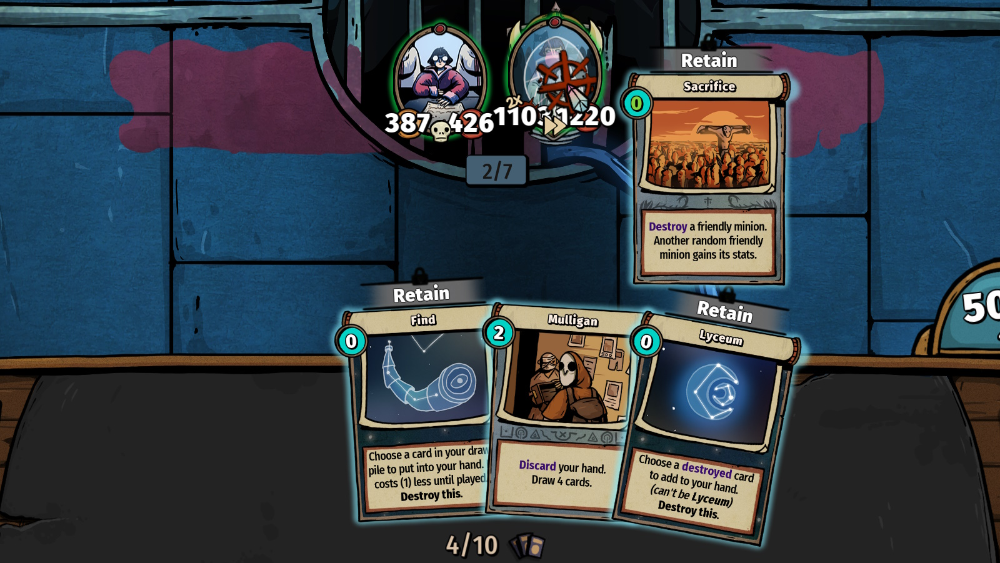

Are you after that Bigger Boy achievement?

You can re-draw a destroyed minion (be it using Destroy or using Slay Solari)
using Lyceum, which you get from Black Light.

You'll need a way to get more Star cards, such as from
- Jack-in-the-Box (relic, see Discard Deck)
- Star Gazing (spell, uncommon, 1 mana)
- Astral Scribe (minion, rare, 2 mana per activation)
