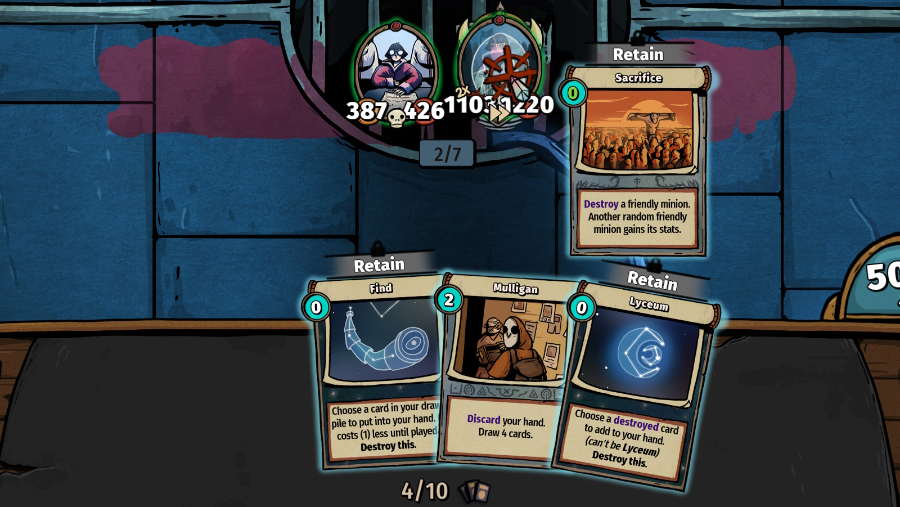

<!-- NB! README.md is generated from all other .md files, don't edit it directly -->
Notes and cool things to try

This guide was originally going to be a little bigger but who's got time for that (not me)

### Table of contents

- [General tips](#general-tips)
- [Progression](#progression)
- [Lore](#lore)
- [Characters](#characters)
- [Builds](#builds)
	- [Battle Spells](#battle-spells)
	- [Discard](#discard)
	- [Exhaust](#exhaust)
	- [Exponential](#exponential)
	- [Flying](#flying)
	- [Random Damage](#random-damage)
	- [Summon & On Death](#summon--on-death)
- [Achievements](#achievements)

# <a name="general-tips"/> General tips
1.	The game saves at the beginning of each turn so you can undo your actions by quitting to the menu and coming back.\
	Random events will play in the same order so this will not save you from certain death,
	but it is a way to undo one-off mishaps like drafting/playing the wrong cards or playing them in wrong order.
2.	Some encounters can be "solved" in several ways instead of brute-forcing them and taking damage.\
	If something seems suspiciously strong, take a good look at enemy cards and what the enemy is
	going to do/cast.\
	A single Ban card can solve many of these.
3.	Your odds of seeing any given relic at some point of a run are slightly under 50%
	so it is a good idea to base your build on one of the three relics that you are offered
	in the beginning of a run instead of hoping that you'll timely get what you want.

Drafting:
1.	Rerolling drafted cards 1 (for free) or a few (for health) times is a good way
	to get cards that you desire or at least avoid cards that you'll never play.
2.	Certain drafts will have cards of certain rarities as the first pick.\
	Rerolling these will offer a different set of cards with that same rarity.
3.	The codex lists all cards and relics that you have picked across your runs and can be opened
	mid-session to check on what there is and what you might get if you reroll.

# <a name="progression"/> Progression
If you are feeling a little lost, the check-list is roughly as following:

Characters are mostly unlocked through randomly encountering them and beating them along the way.\
Don't stress it - you'll get all of them sooner or later.

Your codex lists all cards and relics that you have picked through your runs.
You can check on the codex from the pause menu if necessary.

Specific relics are unlocked for beating the game with a specific character
so expect a few gaps in the codex for a bit.

Beating the game for the first time unlocks an additional area and a little story plot.

Beating the game unlocks Masterworks, which are small difficulty modifiers that will be offered at some points through your run.
You don't _have_ to take them, but if you don't, no further Masterworks will be offered.

Beating the game with all of your unlocked Masterworks unlocks another one until you have them all.

Two of the relics are "prophecies".
I _think_ you need to fulfil them once (even if you don't win that run) for the grand finale?

With everything unlocked, you'll want to beat the game on each character with all Masterworks active.

# <a name="lore"/> Lore
-	The intro cutscene explains the setting a bit and I'm not sure if there's an easy way to watch it again.
-	On the character select screen you can press the diamond button next to the description to show a little lore.
-	The codex shows lore for each card and relic.
-	Beating the game with all Masterworks active shows a cutscene revealing more background about a character and their motivations.  
	You _can_ re-watch these if you beat the game with that character again.
-	The ending cutscene similarly seemingly cannot be re-watched easily so pay attention to that if you care about it.

With all of above combined, you can piece together a reasonably good picture
of what is happening in the game and how did it come to this.

# <a name="characters"/> Characters
## Birdsong Reverie
This is your formal invitation to try building a deck around flying minions - a good way to get your first victory.

Having one extra unit on the field is nice too!

## Pjotter
Some types of decks can be easier to assemble when you can skip the cards that you don't need.

Plaster Cast can be used on both minions and spells,
allowing some interesting combinations with cards that you don't usually have more than a couple of.

If you're doing a build where cloning minions might be beneficial,
a Yo-Yo relic is nice to grab when offered.

## Mercy Burns
Starting with 1 mana less is easily offset by being able to cast Meditate at expense of your health.

Pain Killer is also very strong, being both a heal and a way to draw more cards cheaply.

## Captain Ego
Many number-based relics work better when there are two of them!

And having two of Red Giant makes the early fights a bit silly.

Note that Home Sickness is formally a 6-mana spell so getting Ellipsis Von Battalia on your team
is a pretty big deal.

## Allison Lycette
Getting a handful of Stoke cards in your deck is an obvious strategy,
but you can also get Academy and/or Lyceum through the Black Light relic.

Having some way to retain a Ban card is good for quirkier fights.

## Bill Decker
12 tiers with smaller choices mean that you will have more legendary cards in your deck;

Bill's exhaust card is pretty good for getting rid of cards that you didn't like.

## Poppit
And now for something different
- Since your minions auto-discard, you'll want a way to get more cards
  so that you don't run out of minions.
- Since cards cost nothing to play, you can place a card like Levitator / Trash Fox / Star Scribe, use their active ability,
  and put the card back into your hand.
- Untethered One will come back on the field after being discarded,
  which offers a little safety in case you draw no minion cards.
- As the cards auto-retain, try to finish rounds with 5 cards remaining in hand.  
  Rummage helps with getting through the cards that you can play.
- Automatic discards count towards Jack-in-the-Box.

## Slay Solari
Arguably the most straightforward character?
You stack minions together until you have One Big Boy with all of the abilities.

Having a Calligraphy Pen to retain your Pesticide card can be good for fights with Deathtouch minions.

## Hyphen Von Battalia
Have you noticed that Winner Takes All is a spell and thus is affected by any cards that boost spells?

So if you have +1 spell power, it'll give you +3 mana and +3 cards next round, but it will still cost 2 mana to cast.

Perhaps you can tell where this is going

## Mrs. S
Spoilers, kind of?

Spoiler
It's Sonoya

You can get multiple copies of the same relic from Entropy Ash!

Note that you can still regain health with a Phoenix Egg in case of an emergency.

Generally the most reliable way to pursue any given build.

# <a name="builds"/> Builds
Essentials:
1.	It is a good idea to do a build around one of the relics that you are offered at the beginning
	so that you don't find yourself in a situation
	where you have everything except for the actual relic that makes your deck work.
2.	You can restart your turn by quitting to the main menu and reloading the game.  
	Note that all random events will still have the same outcomes so this will not spare you of inevitable demise if you made series of mistakes along

# <a name="battle-spells"/> Battle Spells
The obvious option

Personal opinion is that you should either do a battle spell build
or don't touch battle spells outside the few that have synergies with your build -
battle spells will cast instead of your minions attacking so a row of weak spells
will do you more bad than good.

## Relics

### Asteroid
Spells gain +1 spell power for each star card played this round.
If you can get a mixed magic/discard deck, you can have your fun.

### Codex Battalia
When you play a battle spell, you draw a card.\
Not too big of a deal but it helps.

### Energy Pillar
Every third battle spell played each round costs 0 mana.\
If you have enough battle spells, you can play expensive cards for free.

### Lyceum Armaments
Summons a 2/2 acolyte with Taunt on the right whenever a battle spell casts.\
Kind of neat if you get Moonlight Enchantress and/or Understudy Sonia.

### Ridiculous Hat
Gives spells +1 spell power, which is good if you are focusing on battle spells
with initial numbers of 2/3.

### Adelaide's Fiddle
Spells remain in play for an additional round.

If you rely on playing piles of cheap battle spells
for Codex Battalia / Farm Witch /etc., this may not be a good thing.

### Regimental Gong
The leader with most battle spells has +1 attack.\
It is best not to let the enemy survive until a fistfight.

## Minions
### Farm Witch (common, 2 mana)
Permanently gains +2 health whenever you play a battle spell.\
You'll need a handful of spells going to get sensible health out of these.

Having an Acclimatize is recommended to bump their attack time to time.

### Battlemage (uncommon, 3 mana)
Gain +1 mana whenever you play a battle spell.
It might be tempting to get mana from Frostbolts this way,
but free mana isn't so free when it makes your minions not attack.

### Selfish Apprentice (uncommon, 3 mana)
Permanently gains +1 attack whenever you play a spell or a battle spell.\
A welcome addition to many decks.

Similarly, Acclimatize is nice to have.

### Dragon Rider (uncommon, 4 mana)
Attacks after a battle spell casts, including Quick Cast ones.

### Amber Mage (rare, 3 mana)
Gives played battle spells +1 power, similar to Ridiculous Hat.

### Ellipsis Von Battalia (legendary)
Whenever a battle spell casts, permanently gains its (original) mana cost in attack+health.

## Battle Spells

### Frostbolt (common, 0 mana)
Sure is cheap, but mostly clutters the deck / spell row once you're past the first few fights.

### Mask Off (common, 1 mana, quick cast)
Places a 2/2 acolyte in front of your cards, which isn't a very good thing.

But at least it's a Quick Cast.

### Rise to the Occasion (common, 1 mana)
Gives your left-most minion +4 attack and Shield.

Not too bad to start with.

### Arcane Enhancement (common, 2 mana, quick cast)
Gives your minions +1/+1.

More or less worthless unless you get its spell power up.

### Fireball (uncommon, 2 mana, quick cast)
Hits the right-most enemy for 9 damage.

This isn't very nice to Amplify.

### Relax (uncommon, 2 mana)
All enemy minions gain -2 attack.

It takes a more specific build to get enough use out of these.

### Blood Mist (uncommon, 2 mana)
Whenever an enemy attacks, it gets hit for 2 damage.

There's use to this even without boosting the spell power as it will peel off shields from enemies.

Getting a few of these and/or their spell power up can make for a situation where enemy minions get
killed before they can attack your minions.

### Hail
For each friendly minion, deals 3 damage to a random enemy minion.

Mostly suitable for a Random Damage build.

### Show of Force
Summons 2/2 acolytes in front and after your minions and gives your minions +2 attack.

### Solo practitioner
Gives a random minion +1/+1; double the minion's stats if it's the only one in play.

At large this is for One Man Army builds.

### Ambush (rare, 2 mana)
Summons a 2/2 ranged acolyte with Quick Attack.
You need to Amplify this or get some summon-specific cards for it to make a difference.

### Burst (rare, 2 mana)
Activates the On Death effects of your minions.\
Increasing the spell power does nothing so this usually isn't a good fit
for a battle spell deck.

### Mimicry (rare, 3 mana)
Your left-most minion becomes an exact copy of your right-most minion.\
Largely situational, but you can duplicate your strongest/quirkiest minion this way.

### Battle Symphony (rare, 4 mana, quick cast)
Gives your minions +4/+4.\
Much like Arcane Enhancement, needs to be amplified to be useful,
but hey, at least it's Quick Cast.

### Soundstorm (rare, 6 mana)
Deals 3 damage to all enemy minions twice.
The first hit removes any potential shields from enemies
so it's a pretty big deal if you get the spell power up.

### Deep Copy (legendary, 2 mana)
Summons exact copies of other battle spells on the field.

But remember that there's a limit on battle spells on the field!

### Crescendo (legendary, 3 mana, quick cast)
Gives your other battle spells +2 spell power.

Increasing the spell power of this spell increases how much it increases power of other spells!

### Enfeebling Spores (legendary, 4 mana)
Makes the left-most enemy minion attack the right-most enemy minion.

Expensive, but useful on a few fights.

## Spells

### Warmup (uncommon, 0 mana)
Reduces the mana cost for the next battle spells by 3.\
Good for casting expensive spells!

### Amplify (uncommon, 3 mana)
Permanently increases the spell power of the drawn spell by 2!

This is good for Crescendo, or just a strong battle spell that you are keeping in play with
Bravo / Fiddle / Find / Lock.

### Harmonize (uncommon, 0-6 mana)
Permanent free +1/+2 for all your minions if you can get 3 battle spells on the field.

### Parting Song (rare, 1 mana)
Makes a battle spell stick around for an additional round and draws a card.
A good deal!

### Bravo (legendary, 1 mana)
Plays a copy of your battle spell that disappears after this turn!\
(or when it runs out of "additional rounds")

# <a name="discard"/> Discard
Not _quite_ an infinite deck, but you can go places.

If you have Jack-in-the-Box (relic) and multiple ways to discard cards,
you can generate yourself large quantities of star cards.

## Other relics

### Loyalty Card
Also make the discarded cards cheaper

### Asteroid
Boost battle spells for each star card played\
... if you have any

### Filing Cabinet
Discard one card per round without having to use Rummage/etc.

### Moonlight Receiver
Boost one of your cards as you pick through the star cards.
Helps if you get it early on.

## Spells, essentials

### Rummage (common, 1 mana)
Draw 2 cards, discard 2 cards from your hand.

Good for playing Eternity Perfumes that made it to your hand.

### Scry (common, 0 mana)
Discard cards before they even make it into your hand. For free!

### Beckon the Moon (uncommon, 2 mana)
Discard the remaining cards in your draw pile!

Once your deck is big enough, this will stuff a handful of star cards into your hand,
potentially including Fish (which you can use to un-exhaust Beckon the Moon).

## Spells, extras

### Eternity Perfume (common, 3 mana)
Gives a minion +3/+3, plays when discarded.

### Mulligan (uncommon, 2 mana)
Discards your hand and draws 4 cards.

A way to get rid of a full hand and get 2-3 star cards in progress

### Deep Breath (rare, 3 mana)
Get two cheaper Meditates.

### Self-exhausting minion spells
Anything that gives minions stats/abilities - you'll be able to Fish these back and
apply them again/on other minions.

## Spells, maybes

### Euphoria (rare, 5 mana)
By the time you get this to half-decent numbers,
Stoke will outweight it while costing nothing to cast.

### Adrenaline (rare, 0 mana)
Can help with boosting cards mid-game,
but will also take up valuable hand space that could be occupied by freshly made star cards.

Hard to get rid of!

### Composting (rare, 2 mana)
in a way similar to Mulligan, but you also get mana next round.

### Overcharge (legendary, 8 mana)
Gives a minion +8/+8, costs 1 mana less for every spell cast this round.

Once you get to half-decent numbers of star cards per round, this is free to cast.

However, Stoke is also free, and will out-do this spell with.

## Minions, nice to have

### Levitator (uncommon, 3 mana)
Activated ability draws 2 cards for 2 mana.

A good way to shuffle your deck after casting casting Beckon the Moon.

### Trash Fox (uncommon, 4 mana)
Activated ability returns a discarded card to your hand for 2 mana.

Can be used to play a spell multiple times per round,
but it has to get in the discard pile first.

### Selfish Apprentice
Gains +1 attack whenever a spell is cast, and you'll be casting a lot of spells!

Get the guy an Acclimatize if you can.

### Living Conduit (legendary, 7 mana)
If you'll be casting a lot of spells to boost minions, might as well double them.

### Jar Smasher
Each Scry will reduce its +2/+2 ability cost to 0,
which is a small convenience for early/mid-game.

# <a name="exhaust"/> Exhaust
To make this work you need a source of minions/cards to exhaust
and a source of cards that can exhaust them

Minion sources:
-	Portable Kiln (relic
one free Jarling per turn
-	Stubborn Bloke (minion, uncommon, 1 mana
can be exhausted any number of times per turn!\
	Hard to actually get rid of without Destroy though.
-	The Jar-Headed One (legendary, 8 mana
similar, but also plays itself and gains +2/+2

Minions:
-	Blissful Bestie (common, 2 mana
gains +1/+1 when a minion is exhausted.\
	Not much, but It's Something.
-	Dumpster Diver (rare, 1 mana
gains +8/+8 each time it's exhausted!
-	Potent Peddler (rare, 2 mana
complimentary, draw a card whenever you exhaust a card (up to 10 per round).
-	Soul Eater (legendary, 3 mana
if you are generating minions, you can get some use out of that as well.

Card exhaust spells:
-	Unravel (spell, common, 2 mana
slightly less good value unless you have Portable Kiln,
	which makes this a way to draw 1 more card (sans the spot that was wasted on Unravel).
-	Cast Aside (spell, uncommon, 1 mana
don't forget that you can move exhaust-able minions back to your hand for this

Minion exhaust spells:
-	Vent (spell, common, 1 mana
good value for Jarlings/etc.!
-	Banish (spell, uncommon, 1 mana
also good value for 1-mana minions.
-	Chaos (spell, rare, 0 mana
you can get some value by exhausting a minion that benefits from it
	and getting a minion card (that you can also exhaust) in return.
-	Recycle (spell, rare, 1 mana
spending 1 mana to get 3 mana is pretty good.

Minion recovery:
-	Teleport (spell, uncommon, 2 mana
ideally you should avoid having to use Teleport.

Relics:
-	Centrifuge: this is like a free Teleport but it also plays the minion to the left of your regular crew.\
	Works very well for Dumpster Diver in particular.
-	Manhole Cover: boost the minions in your exhaust pile, good for Soul Eater.
-	People Counter: boosts your left-most minion based on how many cards you have exhausted.
-	Phasing Jar: might be tempting, but on-exhaust card effects will not trigger
	and you won't be able to get rid of cards when you want.
-	Calligraphy Pen: just keep that Stubborn Bloke in your hand forever.

# <a name="exponential"/> Exponential
Are you after that Bigger Boy achievement?

You can re-draw a destroyed minion (be it using Destroy or using Slay Solari)
using Lyceum, which you get from Black Light.

You'll need a way to get more Star cards, such as from
- Jack-in-the-Box (relic, see Discard Deck)
- Star Gazing (spell, uncommon, 1 mana)
- Astral Scribe (minion, rare, 2 mana per activation)

# <a name="flying"/> Flying

## Relics

### Wing Extensions
+20% dodge chance for flying minions helps get more use out of dodge-related effects.

If you are playing a character that can get multiple of the same relic,
the effect stacks.

### Targeting Machine
Deals 10 damage to the attacker whenever a flying minion dodges.\
Wing Extensions are semi-obligatory to get much use out of this.

## Characters

### Birdsong Reverie
Play flying cards for 1 mana cheaper (and pigeons for free) while Dell is on the table.

### Captain Ego
Get two Wing Extensions or two Targeting Machines right off the bat.

### Mrs. S
Better odds of getting both Wing Extensions and Targeting Machine(s),
as well as potentially getting a game-breaking number of Wing Extensions -
so if you had 3 of these, dodge chance would be 93%..?

## Minions

### Pigeon (common, 1 mana)
Cheap, reliable

### Dove of Avon (common, 2 mana)
+1/+1 per flying minion on attack is pretty good.

If you don't have minions with Taunt,
you should stick to having one dove as the first unit
as these can get hit by enemies before they'll get to attack.

### Comet Catcher (uncommon, 3 mana)
Get 1 star card whenever a flying minion dodges an attack.\
If you get your dodge chance up and/or a few of these, you can drown yourself in star cards.

### Levitator (uncommon, 3 mana)
Draw 2 more cards for 2 mana, very good if you get your mana up and/or a supply of star cards.

### Untethered One (uncommon, 6 mana)
Plays itself when discarded, free to play if you already have Scry.

### Elusive Owl (rare, 3 mana)
Really needs Taunt and Wing Extensions to get any meaningful stat boosts

### Wing Commander (rare, 4 mana)
Gives a permanent +1/+2 boost to flying minions when they attack.\
If you have multiple Wing Commanders and/or Double Strike minions (via Go Up or Dual Wield),
you can get a pretty good boost going.

### Grand Magister Fogg (legendary, 6 mana)
Attacks after a flying minion attacks.\
If you get him flying and have Wing Commanders, Fogg will be getting quite a bit of a stat boost

## Minions (flying/magic)

### Farm witch (common, 2 mana)
Gets +2 health per battle spell cast, and you *could* do a mixed magic/flying deck...

### Amber Mage (rare, 3 mana)
Gives battle spells +1 power, but isn't this slightly expensive for using a minion slot..?

### Dragon Rider (uncommon, 4 mana)
if you're doing a magic/flying deck, you can line up Quick Cast spells
and the dragon will keep hitting enemies between the casts.

## Spells
### Go Up (uncommon, 2 mana, exhausts)
Give any card flight! 

f you get some Fish cards going, you can mix in any cards you like.

# <a name="random-damage"/> Random Damage

## Minions

### Chaotic Caster (common, 1 mana)
Easy to get a bunch of.

You can couple these with a few Quick Attack cards so that the casters fire a few volleys
before any enemy gets to attack.

### Clumsy Freshman (common, 2 mana)
Deals its damage to a random enemy on death.

Only sort of fits in this kind of build.

### Sleeping Death (rare, 2 mana)
Doubles any damage dealt to random enemy minions.

With a little luck you can have multiple of these.

A backbone of a build like this, really.

### Dread Moss (rare, 5 mana)
Deals 3 damage to itself and a random enemy until it runs out of health.

With one Sleeping Death, that'll be 6 damage to enemies, 12 damage with two, and so on.

### General Koi (legendary, 4 mana)
Deals 8 damage to a random enemy minion whenever a friendly shield breaks.

But you can only have so many shields.

## Relics

### Throwing Knife
Deals 2 damage to a random enemy minion when you summon a minion.

Might be tricky to fit enough cards+relics for a mixed random damage / summon build though.
	
## Battle spells

### Frost Bolt (common, 0 mana)
Don't stick too many of these in your deck.

### Hail (uncommon, 3 mana)
3 damage per each of your minions, good once boosted.

# <a name="summon--on-death"/> Summon & On Death
This build grows visibly more powerful as you stack more minions/relics with synergies.

## Relics

### Overseer's Whip
At large makes the build work because summoned minions will attack enemies instead of stockpiling and using up your turns/desk space.

### Skull of the Taker
Gives you a Taker's Dragon once enough minions die!
Pretty important.

### Throwing Knife
Hits a random enemy for 2 damage whenever you summon a minion.\
It's not much, but it helps a bit.

### Vengeance Ring
Gives other minions +1 attack whenever a minion dies,
which will happen more often if you're summoning these.

### Tombstone
Triggers on-death effect of your left-most minion on round start.
Summon a couple minions or another dragon if you have Jean-Paul Gardinette.

### Mushroom Tea
Gives minions permanent +2 attack when their on-death effects trigger.

This is a sensible boost for minions that have to die anyway.

### Lyceum Armaments
Summon additional minions when you use battle spells

### Loudspeaker
Summon a random minion whenever a minion with Taunt dies.
Good if you can get Radicalize for your minions with on-death effects.

## Minions (on-death)

### Talent Scout (common, 1 mana)
Summons a 2/2 acolyte on death. Gotta start somewhere, right?

### Clumsy Freshman (common, 2 mana)
Deals its attack as damage to a random enemy on death.

If you get a Mushroom Tea early on, can grow to be a fairly reasonable source of damage.

And if you also get an Acclimatize...

### Spore Pod (uncommon, 2 mana)
Summons two sporelings when destroyed.

### Field Nurse (uncommon, 2 mana)
Gives a random unshielded friendly minion a Shield on death.

But it's not so much about shields, is it? Especially not random ones.

### Buried Mandrake (uncommon, 4 mana)
Subtracts 3 attack from all enemies on death.

Kind of needs its own battle spell build to be useful in mid/late-game.

### Moonlit Summoner (rare, 3 mana)
Summons a 2/2 acolyte with Cleave on death.

This can be pretty powerful when combined with Moonlight Enchantress and Summoner/Whip.

### Jean-Paul Gardinette (legendary, 3 mana)
Copy that Taker's Dragon if you have it.

## Minions (support)

### Overseer (uncommon, 3 mana)
Summoned minions attack immediately and get +2 attack.

If you have both Overseer and Whip or two Overseers,
summoned minions will ""double-strike"".

### Moonlight Enchantress (rare, 4 mana)
Summoned minions gain attack of this minion. Semi-obligatory.

### Understudy Sonia (legendary, 5 mana)
Gives minions a little more attack and Shield.

Once you are summoning enough minions, this is no longer such a good thing because the minions
will survive and stockpile until your minion limit.

### Taker's Dragon (from Skull of Taker, 0 mana)
Makes all on-death effects happen twice.
At large this is like having 2x minions with on-death effects per dragon.

## Minions (complimentary):

### Carrion Rose (common, 1 mana)
Gains +1 health for the round whenever another minion dies is _sort of_
good but in early game you probably won't have that many minions and in late game you'll want
the minion slot to be taken up by something more useful.

### Middle Manager (common, 2 mana)
Summons random common minions whenever it attacks and survives.

### Ritualist (uncommon, 2 mana)
Sort of like Throwing Knife, but as a minion.

### Lifedrinker (rare, 4 mana)
Can grow a fair bit if you get a deck going.

### General Koi (legendary, 4 mana)
If you have Sonia, this is extra 8 damage per summoned minion

## Battle spells

### Mask Off (common, 1 mana)
Summons a very regular 2/2 acolyte in front of your minion row.

### Ambush (rare, 2 mana)
Summons an acolyte with Ranged and Quick Attack.

### Burst (rare, 2 mana)
Activates On Death effects of your minions.

### Mimicry (rare, 3 mana)
A less reliable replacement for Jean-Paul Gardinette.

## Spells

### Duplicate (rare, 1 mana)
Copy that dragon or other cool minions.

# <a name="achievements"/> Achievements
Beating the game as per Progression will get you most of the achievements;

## Lord Alderson Koi
This is linked to completing a relic's prophecy.

Spoiler
(Skull of the Taker)

## Dreams Within Dreams
This is also linked to completing a relic's prophecy.

Spoiler
(Sonoya's Prophecy)

## Taker's Revenge
Beat Moon-3 on the first turn of battle.

There are a handful of ways to achieve this:
- A random damage deck
- A sufficiently buffed Soundstorm on a battle spell deck
- A summon deck with Tombstone and a long enough chain of summons
- 3+ minions with Quick Attack + Double Strike + Cleave from Black Light.  
  Note that there's an increasingly slim chance that the single flying minion will dodge all of those attacks.

## One Man Army
You can swap units around but there must always be one at play when you click End Round.

I think the easiest way to get this is to take a Wishbone as Mrs. S if it's offered
as the first relic and then do a Discard build, possibly with a side of additional Wishbones
if they are offered by Entropy Ash.

- Black Light helps a bunch.
- Solo Practitioner is nice, but only if you draw it in time.
- Having a Middle Manager as your only minion can help as you'll most likely have two minions/hits by the time the enemy is out of minions.

Note that you don't have to survive Moon-3, just make it there.

You also don't even have to play with 6 Masterworks.

## Save the Cat
You've seen the cat, right?

Spoiler
You shoo it away every time you enter Lyceum

Spoiler
Make a copy of it using Garden from Black Light and beat Moon-3 with the cat on the table

Spoiler
You can do this on Slay Solari for added comedy.

## Startrash
I think this is by far the easiest on Slay Solari as the character is a build of its own out of box.

Similarly, you don't have to survive Moon-3.

## One Take Wonder
Beat the game with 6 masterworks on a daily challenge!\
No turn re-takes.

I think this is the easiest to get with Mrs. S or Slay Solary,
but you can play any character you like, really.

And if you mess up, there's always tomorrow.